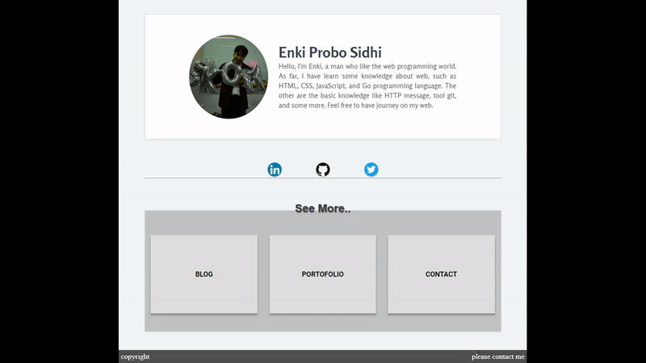

## Preview
Preview:

## Deskripsi
Projek ini bertujuan untuk membuat website portofolio enki yang sudah menerapkan desain *responsive web*.

## Catatan
* Pada saat di mobile kalau tidak menambahkan meta viewport maka akan ada yang aneh pada ukuran pixelnya. contoh: di set 13px tetapi malah kelihatannya kecil sekali.
* Susahnya membuat footer berada selalu dibawah, untuk mengatasi hal tersebut digunakan javascript agar dapat men-*detect* ukurang layar dulu.

## Beberapa hal yang masih menmbingungkan
* Kenapa saat header diset margin top-nya malah bodynya ikut ke geser?
* Tentang desain, masih banyak kurangnya..
* Belum bisa blur.